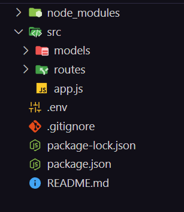

### Installation and configuration of environment variables

1. Installation
```
npm install dotenv
```

2. In the root of your project you must create an `.env` file and add it to the `.gitignore` file.



3. Configure MongoDB url in your `.env` file
```
MONGO_URL=mongoUrl
```

4. In your `src/app.js` file
```javascript
import dotenv from 'dotenv'
dotenv.config()
console.log(process.env.MONGO_URL)
```

5. Configure the connection to the MongoDB URL
```javascript
mongoose.connect(process.env.MONGO_URL)
    .then(() => { console.log("Conectado a la base de datos") })
    .catch(error => console.error("Error en la conexion", error))
```